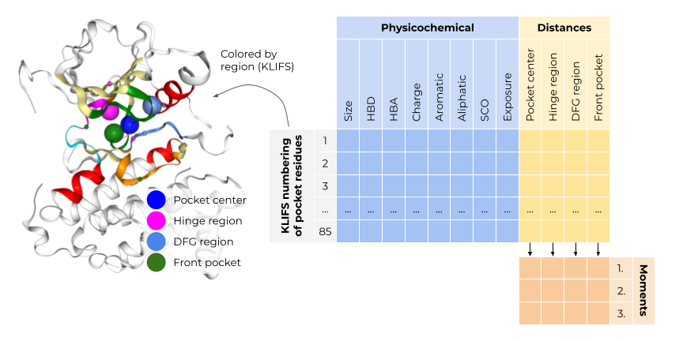

Structural kinase similarity (`kissim`)
==============================
[//]: # (Badges)

> ⚠ This project is work-in-progress.

**Subpocket-based structural fingerprint for kinase pocket comparison** 

## Description

The `kissim` package offers a novel fingerprinting strategy designed specifically for kinase pockets, 
allowing for similarity studies across the structurally covered kinome. 
The kinase fingerprint is based on the [KLIFS](klifs.net/) pocket alignment, 
which defines 85 pocket residues for all kinase structures. 
This enables a residue-by-residue comparison without a computationally expensive alignment step. 

The pocket fingerprint consists of 85 concatenated residue fingerprints, 
each encoding a residue’s spatial and physicochemical properties. 
The spatial properties describe the residue’s position in relation to the kinase pocket center and 
important kinase subpockets, i.e. the hinge region, the DFG region, and the front pocket. 
The physicochemical properties encompass for each residue its size and pharmacophoric features, solvent exposure and side chain orientation.

Take a look at the [repository `kissim_app`](https://github.com/volkamerlab/kissim_app) for pairwise comparison of all kinases to study kinome-wide similarities.

## Documentation

> This package is still in development.

The `kissim` package documentation is available [here](https://kissim.readthedocs.io/).

## Contact

Please [open an issue](https://github.com/volkamerlab/kissim/issues) if you have questions or suggestions.

We are looking forward to hearing from you!

## License

This work is published under the [MIT license](https://github.com/volkamerlab/kissim/blob/master/LICENSE).

Copyright (c) 2019, Volkamer Lab

## Acknowledgements

### Funding

Volkamer Lab's projects are supported by several public funding sources
(for more info see our [webpage](https://volkamerlab.org/)).

### Collaborators

The `kissim` project is a collaboration between the Volkamer Lab (Dominique Sydow, Eva Aßmann and Andrea Volkamer), Albert Kooistra (University of Copenhagen) and Friedrich Rippmann (Merck).

### External resources

#### Databases

- [KLIFS](https://klifs.net/)

#### Python packages

- Cheminformatics and structural bioinformatics:
  [`opencadd`](https://opencadd.readthedocs.io/en/latest/),
  [`biopython`](https://biopython.org/),
  [`biopandas`](http://rasbt.github.io/biopandas/)
- Data science (PyData stack):
  [`numpy`](https://numpy.org/),
  [`pandas`](https://pandas.pydata.org/),
  [`scikit-learn`](https://scikit-learn.org/),
  [`jupyter`](https://jupyter.org/),
  [`ipywidgets`](https://ipywidgets.readthedocs.io)
- Data visualization:
  [`matplotlib`](https://matplotlib.org/), 
  [`seaborn`](https://seaborn.pydata.org/),
  [`nglview`](http://nglviewer.org/nglview/latest/)
- Continuous integration:
  [`pytest`](https://docs.pytest.org),
  [`nbval`](https://nbval.readthedocs.io)
- Documentation:
  [`sphinx`](https://www.sphinx-doc.org),
  [`nbsphinx`](https://nbsphinx.readthedocs.io)
- Code style:
  [`black-nb`](https://github.com/tomcatling/black-nb)

#### Repository

Project is based on the 
[Computational Molecular Science Python Cookiecutter](https://github.com/molssi/cookiecutter-cms) version 1.5.
